# RPI Hailo-10H Web Dashboard

> Real-time hardware monitor for the **Raspberry Pi 5 + Hailo-10H AI accelerator**.
> Dark-themed, auto-refreshing web dashboard — no JS framework, no build step, one Python file.


---

## Looking for a general-purpose Pi dashboard?

This project is Hailo-specific. If you want a broader system dashboard — CPU, memory, disk, network, GPU, processes, GPIO, Docker, and more — check out **[raspi-dash](https://github.com/kristoffersingleton/raspi-dash)**: a single-file, zero-dependency Raspberry Pi dashboard that works on any Pi without any AI hardware.

---

## Features

- **Hailo-10H accelerator** — firmware version, architecture, PCIe link speed/width, boot source, NN clock rate, loaded HEF networks, health/throttling state
- **Pi CPU** — temperature (°C / °F), frequency, core voltage, throttle flags
- **Memory** — Pi LPDDR4X + Hailo onboard LPDDR5X side-by-side with usage bars, swap
- **Fan** — live RPM via sysfs hwmon, animated ring indicator
- **System** — uptime, Pi model, disk usage, full PCIe device list
- Auto-refreshes every **2 seconds** via `fetch()` — no page reload needed
- Gracefully degrades: each card renders with whatever data is available; missing metrics show N/A rather than crashing

---

## Architecture

```mermaid
flowchart TD
    Browser["🌐 Browser\n─────────────\nGET /\nGET /api/stats"]

    subgraph server["server.py"]
        Flask["Flask\n──────────────────\n/ → Dashboard HTML\n/api/stats → JSON"]
        Collector["StatsCollector\n──────────────────\nbackground thread\nevery 2 s"]
    end

    subgraph collectors["Collectors"]
        H["_hailo()"]
        C["_cpu()"]
        M["_memory()"]
        F["_fan()"]
        S["_system()"]
    end

    subgraph sources["Data Sources"]
        SRC_H["hailortcli · hailo_platform API\n/dev/hailo0\n/sys/bus/pci/devices/…"]
        SRC_C["vcgencmd · /proc/loadavg"]
        SRC_M["/proc/meminfo"]
        SRC_F["/sys/class/hwmon/hwmonN/fan1_input"]
        SRC_S["/proc/uptime · /proc/device-tree/model\ndf · lspci"]
    end

    subgraph hw["Hardware"]
        HAILO["Hailo-10H\nM.2 PCIe HAT"]
        PI["Raspberry Pi 5"]
        FAN["Active Cooler"]
    end

    Browser -->|"HTTP poll every 2 s"| Flask
    Flask <--> Collector
    Collector --> H & C & M & F & S
    H --> SRC_H --> HAILO
    C --> SRC_C --> PI
    M --> SRC_M --> PI
    F --> SRC_F --> FAN
    S --> SRC_S --> PI
```



---

## Requirements

**Hardware**
- Raspberry Pi 5
- Hailo-10H via PCIe M.2 HAT (or Hailo-8/8L — note: temp/power metrics only available on 8/8L)

**Software**
- Python 3
- Flask: `pip install flask`
- Hailo RT driver and `hailortcli` installed (from the Hailo developer zone or apt)
- `hailo_platform` Python package (optional — used for richer stats; CLI fallback always active)

---

## Running

```bash
python3 server.py          # http://0.0.0.0:8765/
python3 server.py 9000     # custom port
```

Navigate to `http://<pi-ip>:8765/` from any browser on your network.

---

## API

| Endpoint | Description |
|---|---|
| `GET /` | Dashboard HTML |
| `GET /api/stats` | JSON snapshot: `hailo`, `cpu`, `memory`, `fan`, `system` keys |

Example (abbreviated):

```json
{
  "hailo": {
    "present": true,
    "firmware_ok": true,
    "architecture": "HAILO10H",
    "fw_version": "5.1.1",
    "nn_clock_mhz": 1000.0,
    "loaded_networks": 0
  },
  "cpu": { "temp_c": 52.1, "freq_mhz": 2400, "throttle_ok": true },
  "fan": { "rpm": 1800, "hwmon": 2 }
}
```

---

## Notes

- **Limitations**: It is somewhat disappointing that it looks like methods to determine how much of the hailo memory is actually being used is not currently working FOR NOW.  It will show the full amount available, and spikes on the PI memory usage but you can probably just know that it has 8GB and pull what the pi is using from BTOP instead.   Will see if these change over time. 

- **Hailo-10H SoC mode**: `get_chip_temperature()` and `power_measurement()` return `HAILO_INVALID_OPERATION` — this is a hardware limitation, not a bug. The dashboard shows N/A for those fields.
- **Firmware unresponsive** after a `chip_reset()`: a full power cycle is required. `rmmod`/`modprobe` alone is not sufficient to reload firmware on Hailo-10H.
- The PCIe sysfs path is auto-detected from `lspci` output — no hardcoded bus addresses.
